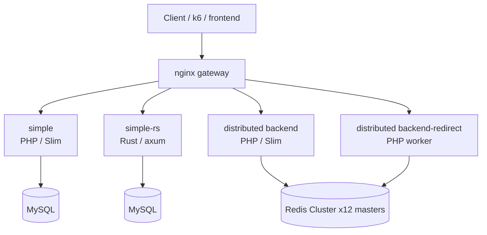
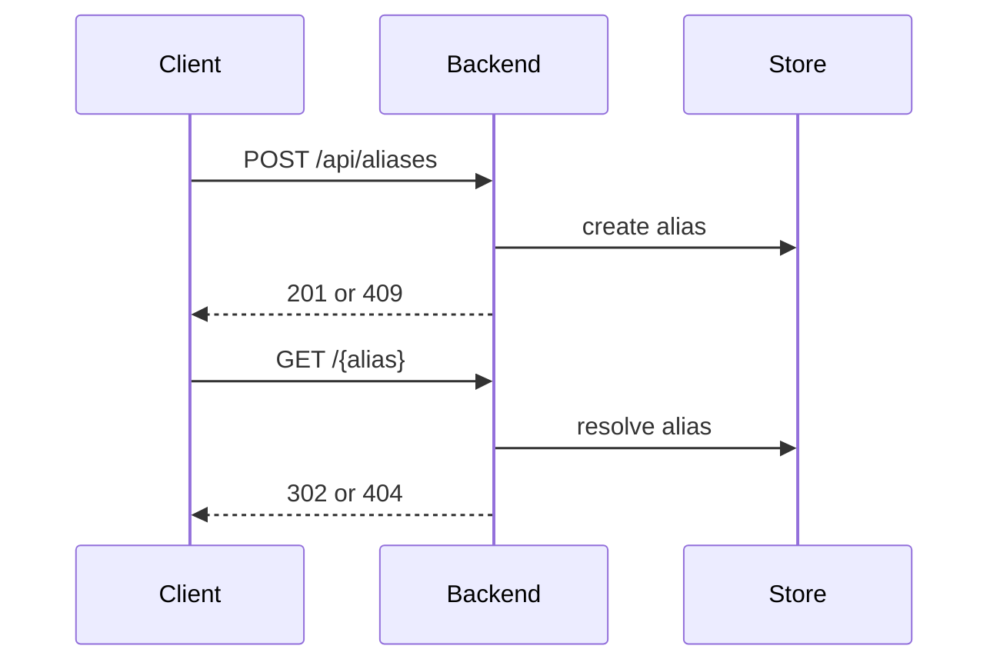
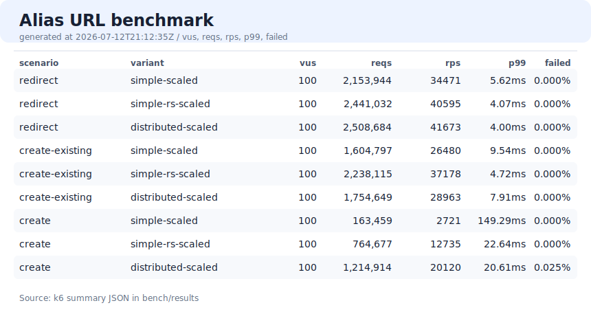
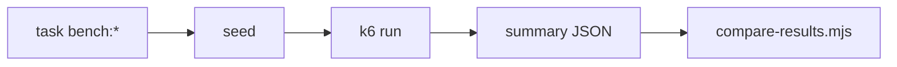

# Alias URL

短縮 URL backend 構成の比較用リポジトリです。API contract は共通にし、実装と storage topology を比較します。

## 構成



| variant | backend | store | 主な目的 |
| --- | --- | --- | --- |
| `simple` | FrankenPHP + Slim | MySQL | 基準実装 |
| `simple-rs` | Rust + axum + sqlx | MySQL | 実装言語差分の比較 |
| `distributed` | FrankenPHP + Slim / redirect worker | Redis Cluster | Redis Cluster / redirect 分離の比較 |

## API



登録:

```http
POST /api/aliases
Content-Type: application/json

{
  "url": "https://example.com/page",
  "alias": "campaign-2026"
}
```

成功:

```json
{
  "alias": "campaign-2026",
  "url": "https://example.com/page",
  "shortUrl": "http://localhost:8080/campaign-2026"
}
```

## 起動

```bash
task simple:up
task simple-rs:up
task distributed:up
```

停止:

```bash
task simple:down
task simple-rs:down
task distributed:down
task down:all
```

frontend:

```bash
task frontend:dev
```

## ベンチマーク





通常比較:

```bash
task bench:all
```

bulk seed:

```bash
task bench:all:medium
task bench:all:large
```

scaled:

```bash
task bench:all:scaled
task bench:all:medium:scaled
task bench:all:large:scaled
```

large scaled 比較:

```bash
task bench:all:large:scaled
```

詳細:

- [bench/README.md](bench/README.md)
- [variants/simple/ARCHITECTURE.md](variants/simple/ARCHITECTURE.md)
- [variants/simple-rs/ARCHITECTURE.md](variants/simple-rs/ARCHITECTURE.md)
- [variants/distributed/ARCHITECTURE.md](variants/distributed/ARCHITECTURE.md)
