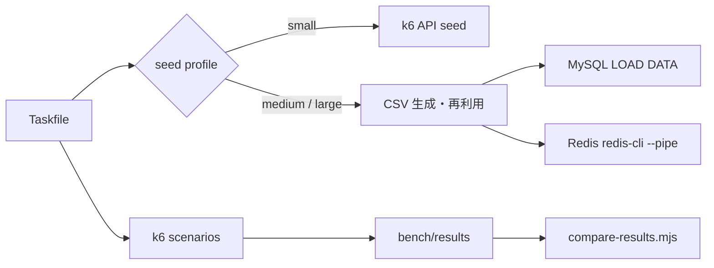
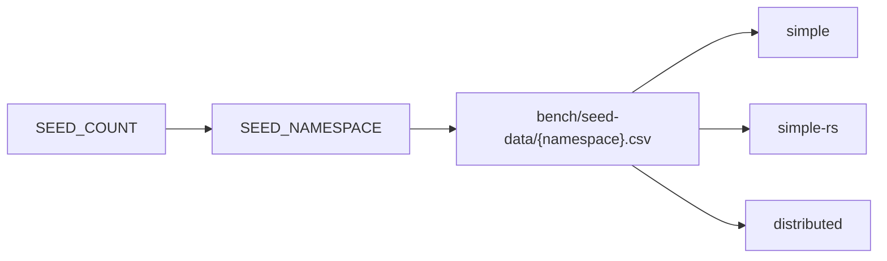
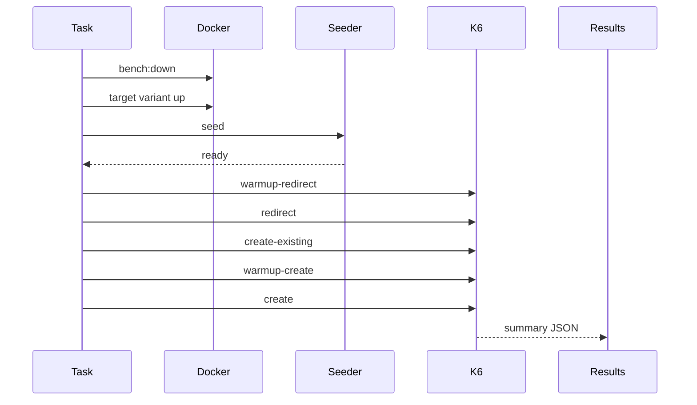

# ベンチマーク

k6 で `simple` / `simple-rs` / `distributed` を比較します。

## 全体像



## Seed Profile

| profile | 件数 | 投入方法 |
| --- | ---: | --- |
| `small` | 1,000 | k6 から `POST /api/aliases` |
| `medium` | 1,000,000 | CSV + bulk load |
| `large` | 100,000,000 | CSV + bulk load |

CSV は `bench/seed-data/{SEED_NAMESPACE}.csv` に生成します。デフォルトの `SEED_NAMESPACE` は seed 件数です。



例:

```bash
SEED_PROFILE=medium task bench:all
SEED_PROFILE=large task bench:all:scaled
```

## よく使う Task

```bash
task bench:all
task bench:all:medium
task bench:all:large

task bench:all:scaled
task bench:all:medium:scaled
task bench:all:large:scaled
```

large scaled の調整例:

```bash
DB_MAX_CONNECTIONS=32 \
WORKER_MAX_REQUESTS=10000000 \
BACKEND_SCALE=3 \
BACKEND_REDIRECT_SCALE=3 \
task bench:all:large:scaled
```

## 計測フロー



## シナリオ

| シナリオ | 内容 |
| --- | --- |
| `redirect` | seed 済み alias を読み、`302` を期待 |
| `create-existing` | seed 済み alias を再登録し、`409` を期待 |
| `create` | 未使用 alias を登録し、`201` を期待 |
| `health` | HTTP の基準値 |

`redirect` は k6 の URL tag を `GET /:alias` に固定し、alias ごとの高 cardinality metrics を避けます。

## 比較

```bash
task bench:compare:all
task bench:compare:scaled:all
```

出力には `rps`, `med`, `p95`, `p99`, `p99.9`, `max`, status counter, conflict reason を含みます。

## GitHub Actions

`Benchmark` workflow は手動実行です。実行後、`gh-pages` ブランチへ SVG レポートを配置します。

README は以下を直接表示します。

```text
https://raw.githubusercontent.com/sumiredc/alias-url/gh-pages/bench/latest/summary.svg
```

GitHub hosted runner では `small` を推奨します。`medium` / `large` は self-hosted runner 向けです。

## 主な環境変数

| 変数 | 既定値 | 用途 |
| --- | --- | --- |
| `BASE_URL` | `http://localhost:8080` | k6 の接続先 |
| `API_BASE_URL` | `BASE_URL` | create / seed / health の接続先 |
| `REDIRECT_BASE_URL` | `BASE_URL` | redirect の接続先 |
| `RUN_ID` | task ごと | 結果ディレクトリ・alias namespace |
| `SEED_PROFILE` | `small` | `small` / `medium` / `large` |
| `SEED_COUNT` | profile 依存 | seed 件数の上書き |
| `SEED_NAMESPACE` | `SEED_COUNT` | CSV 再利用単位 |
| `DB_MAX_CONNECTIONS` | variant 依存 | `simple-rs` MySQL pool 上限 |
| `WORKER_MAX_REQUESTS` | `100000` | FrankenPHP worker recycle 閾値 |
| `BACKEND_SCALE` | task 依存 | backend replica 数 |
| `BACKEND_REDIRECT_SCALE` | task 依存 | redirect backend replica 数 |
| `REDIRECT_CACHE_MAX_ENTRIES` | `10000` | distributed redirect のローカル cache 最大件数 |
| `LOCAL_BLOOM_FILTER_BITS` | `10000000` | distributed create の Bloom filter bit 数 |
| `LOCAL_BLOOM_FILTER_HASHES` | `7` | distributed create の Bloom filter hash 数 |
| `BLOOM_FLUSH_EVERY_ADDS` | `10000` | Bloom filter を bloom-redis へ OR flush する追加件数 |
| `BLOOM_ROTATE_ESTIMATED_ITEMS` | `250000` | Bloom filter generation を進める推定件数 |
