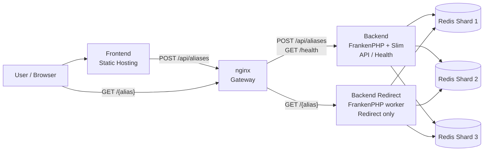
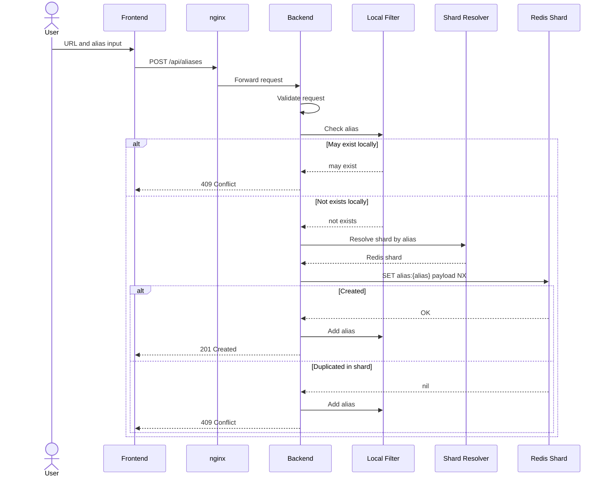

# Distributed Architecture

このドキュメントは、`distributed` 構成で目指すインフラ構成と設計方針を整理します。

`distributed` は実装済みの `simple` 構成とは異なり、短縮 URL サービスを水平分散させるための学習用構成です。Redis Cluster は使わず、独立した Redis shard をアプリケーション側で選択します。

現在の構成では、登録系 API を処理する汎用 `backend` と、redirect だけを処理する `backend-redirect` を分離しています。`backend-redirect` は Slim を通さず、FrankenPHP worker から軽量 entrypoint を直接実行します。

## 目的

- 用途に応じた DB 選択を学ぶ
- Backend と DB の水平スケールを学ぶ
- 中央集権的な `UNIQUE` 制約ではなく、shard-local な疑似ユニーク制約を扱う
- redirect の hot path を登録系 API から分離する
- topology 変更時の整合性と運用上の妥協点を明確にする

## インフラ構成



## コンポーネント

### Frontend

`frontend` は `simple` と共通で利用します。

API contract は `simple` と同じにし、Backend 構成の違いを Frontend に漏らさない方針です。

### Gateway

nginx を Gateway として利用します。Caddy 構成もサブ比較用に残します。

`/api/*` と `/health` は汎用 `backend` に、`/{alias}` は redirect 専用の `backend-redirect` に転送します。

### Backend

Backend は以下を担当します。

- リクエストバリデーション
- 短い alias の local exact set による早期 reject
- local Bloom Filter による重複 alias の早期 reject
- alias から Redis shard を決定する
- alias 登録時に Redis へ atomic write する

Backend 自体は状態を持ちません。

local exact set と local Bloom Filter は、永続データではなく Backend プロセス内の補助的な高速 reject 用データとして扱います。最終的な保存とユニーク検証は Redis の `SET NX` が担当します。

### Backend Redirect

`backend-redirect` は redirect 専用 Backend です。

- Slim / PSR-7 / DI / middleware を通さずに `src/redirect-index.php` を実行する
- alias から Redis shard を決定する
- redirect 時に Redis から URL を取得する
- `302 Redirect` または `404 Not Found` を返す

汎用 `backend` と worker pool を分けることで、登録系 API の負荷が redirect の tail latency に影響しにくい構成にします。

`backend-redirect` は `/api/*` を提供しません。alias 登録は常に汎用 `backend` が担当します。

### Redis Shards

Redis は Cluster として構成せず、独立した複数台の Redis として扱います。

```text
redis-1
redis-2
redis-3
```

alias を routing key として hash し、保存先 shard を決定します。

```text
shard = consistentHash(alias)
```

保存するデータは `alias -> URL` の KVS を基本とします。

```text
key:
  alias:{alias}

value:
  {"url":"https://example.com","created_at":"2026-06-26T10:00:00+09:00"}
```

## 登録フロー



## リダイレクトフロー

```mermaid
sequenceDiagram
    actor User
    participant LB as nginx
    participant Backend as Backend Redirect
    participant Resolver as Shard Resolver
    participant Redis as Redis Shard

    User->>LB: GET /{alias}
    LB->>Backend: Forward request
    Backend->>Backend: Parse alias from REQUEST_URI
    Backend->>Resolver: Resolve shard by alias
    Resolver-->>Backend: Redis shard
    Backend->>Redis: GET alias:{alias}

    alt Found
        Redis-->>Backend: URL
        Backend-->>User: 302 Redirect
    else Not found
        Redis-->>Backend: null
        Backend-->>User: 404 Not Found
    end
```



## ユニーク検証

`distributed` では、MySQL の `UNIQUE(alias)` のような中央集権的な制約は使いません。

通常時は以下の組み合わせで alias の疑似ユニーク性を担保します。

```text
same alias
  -> same hash
  -> same Redis shard
  -> SET NX
```

同じ alias は同じ shard に送られるため、対象 shard 内の `SET ... NX` によって重複を検出します。

```text
SET alias:{alias} payload NX
```

成功した場合は登録完了、失敗した場合は既存 alias として `409 Conflict` を返します。

### Backend local filter

Redis への到達頻度を抑えるため、Backend はプロセス内メモリに local filter を持ちます。

local filter は Backend 間で共有しません。共有しないため、グローバルな存在確認には使わず、重複しやすい alias を早期に reject する補助機構として扱います。

```text
local filter may exist:
  -> 409 Conflict

local filter not exists:
  -> Redis SET NX
```

1文字など候補数が極端に少ない alias は Bloom Filter ではなく exact set で扱います。

```text
1文字 alias:
  local exact set

2文字以上:
  local Bloom Filter
```

登録成功時、または Redis `SET NX` が重複で失敗した時に、Backend は local filter に alias を追加します。

```text
SET NX success:
  add alias to local filter

SET NX duplicate:
  add alias to local filter
```

local Bloom Filter は false positive を許容します。つまり、実際には未使用の alias であっても `409 Conflict` を返す可能性があります。この妥協により、短い alias や意味のある alias への高頻度な登録試行を Redis に到達させる前に落とします。

local Bloom Filter と local exact set は worker プロセスのメモリ上に保持します。時間ベースのリセットは行わず、`WORKER_MAX_REQUESTS` による worker 再起動時に local filter 全体が破棄されます。

redirect 時には local Bloom Filter を使いません。local filter は Backend 間で共有されないため、存在する alias を誤って `404 Not Found` にする可能性があるためです。

## ベンチマーク用 direct 構成

gateway の影響を切り分けるため、direct 構成を用途別に分けます。

### Backend direct

```text
localhost:8080 -> backend
```

汎用 `backend` を直接 expose します。`create-existing` と `create` の計測に使います。汎用 `backend` から redirect route は削除しているため、redirect 計測には使いません。

### Redirect direct

```text
localhost:8081 -> backend
localhost:8080 -> backend-redirect
```

`seed-aliases` は `backend` に対して実行し、`warmup-redirect` と `redirect` は `backend-redirect` に対して実行します。

```text
seed:
  BASE_URL=http://localhost:8081

redirect:
  BASE_URL=http://localhost:8080
```

この分離により、汎用 backend direct と redirect backend direct をそれぞれ意味のある単位で比較できます。
