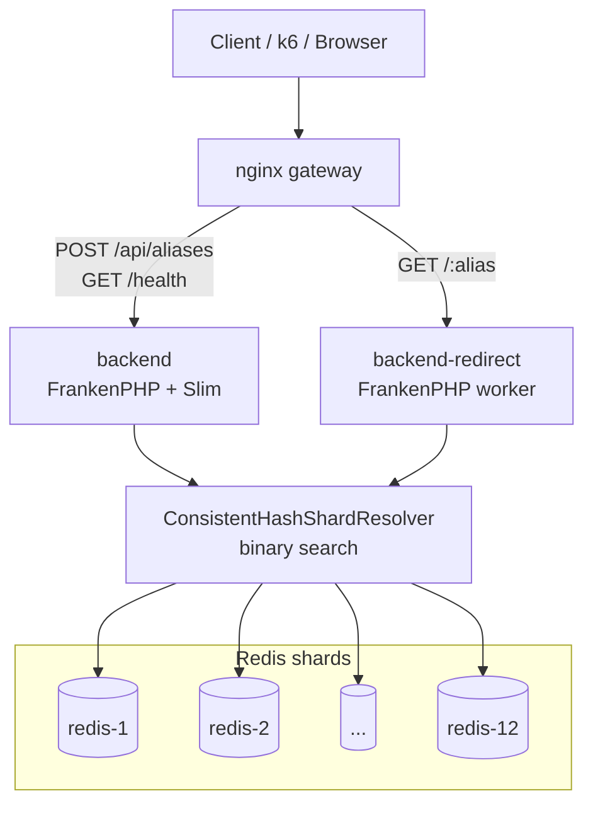
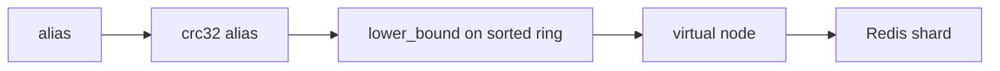
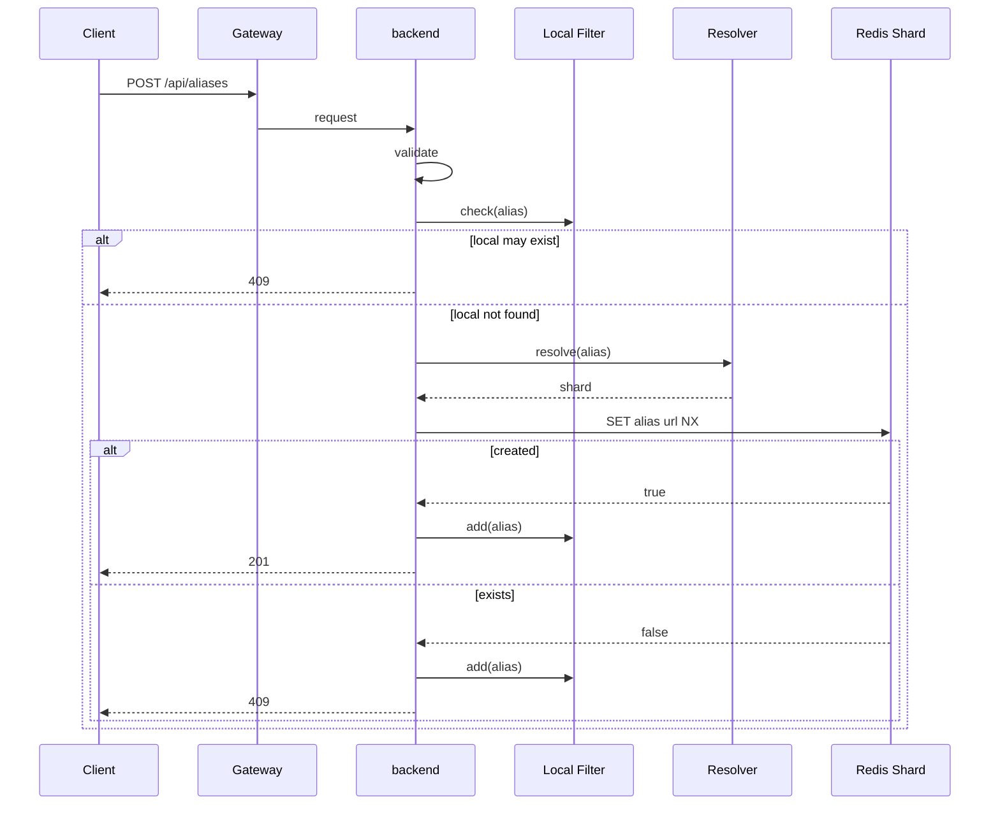
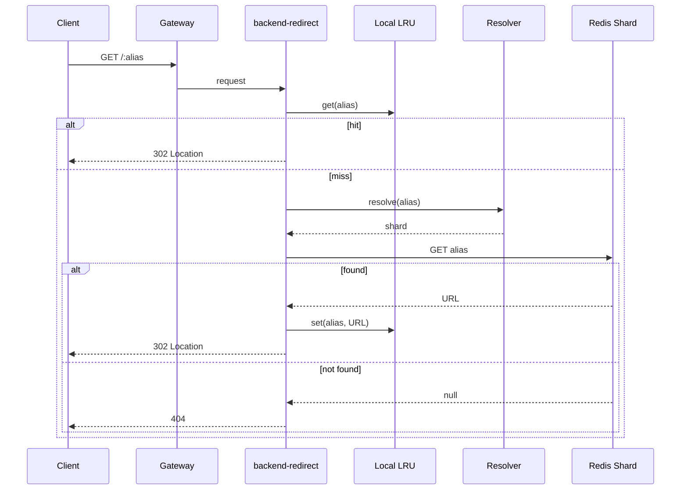
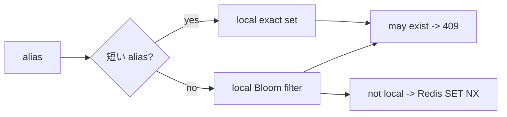
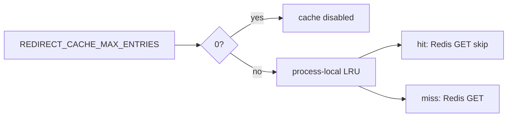
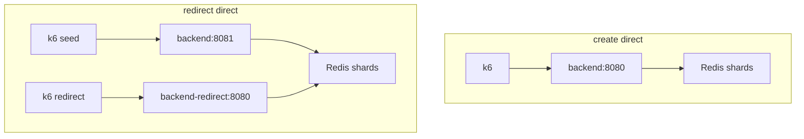

# distributed アーキテクチャ

`distributed` は Redis shard を primary store にする構成です。

## トポロジ

## シャーディング

| 項目 | 値 |
| --- | --- |
| shard 数 | 12 |
| virtual nodes | 1024 / shard |
| 探索 | sorted ring に対する binary search |
| Redis key | `{alias}` |
| Redis value | `{url}` |
| Redis クライアント | phpredis |

Redis Cluster は使っていません。Redis Cluster の hash slot ではなく、アプリ側の consistent hash ring で shard を決めます。

## 登録経路

## リダイレクト経路

## ローカル Filter

create 用の早期 reject です。redirect では使いません。

| 項目 | 内容 |
| --- | --- |
| 用途 | create / create-existing の Redis 到達削減 |
| 所有 | backend worker process |
| 共有 | しない |
| 永続化 | 未実装 |
| false positive | 許容する |

永続化する場合は、専用 `redis-bloom` に定期 flush し、`BITOP OR` で merge する方針です。

## リダイレクト Cache

cache は `backend-redirect` worker process ごとに独立します。

## Direct ベンチ

