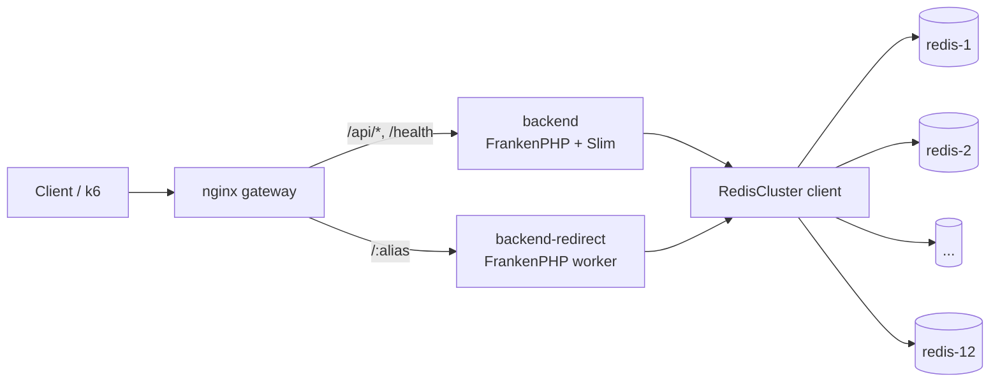
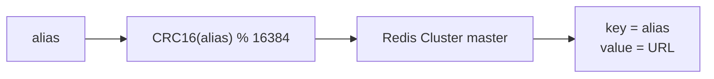
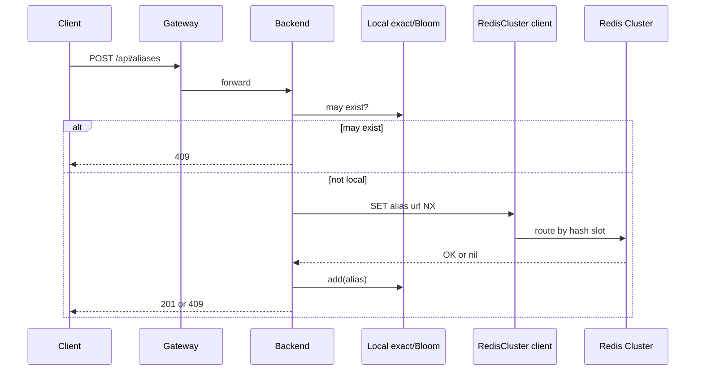
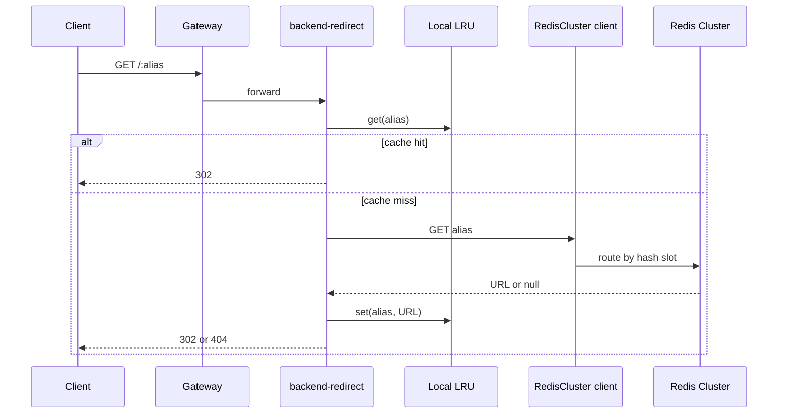

# distributed

Redis Cluster を使う分散構成です。登録系 backend と redirect 専用 backend を分けます。

## 構成



## データ

Redis は 12 master node の Cluster です。アプリは key を渡し、Redis Cluster の hash slot に routing を任せます。



保存形式:

```text
{alias} => {url}
```

例:

```text
bench-100000000-seed-1 => https://example.com/benchmark/bench-100000000-seed-1
```

## 登録



## リダイレクト



`backend-redirect` は Slim を通さず、`src/redirect-index.php` を直接実行します。Redis クライアントは phpredis です。

## リダイレクト Cache

process-local な LRU cache です。デフォルトは無効です。

```bash
REDIRECT_CACHE_MAX_ENTRIES=100000 task bench:all:large:scaled
```

| 変数 | 既定値 | 内容 |
| --- | ---: | --- |
| `REDIRECT_CACHE_MAX_ENTRIES` | `0` | 0 で無効。1 以上で worker process 内 cache を有効化 |

cache は replica / worker ごとに独立し、worker 再起動で破棄されます。

## 主要 task

```bash
task distributed:up
task distributed:up:scaled
task distributed:down
task distributed:logs

task bench:all
task bench:all:scaled
task bench:all:medium
task bench:all:large
```
