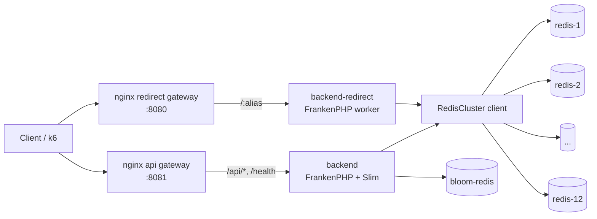
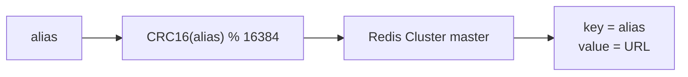
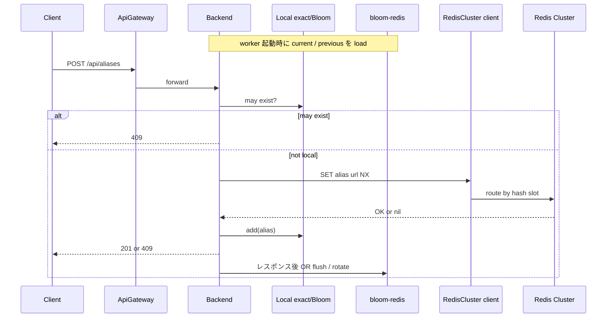
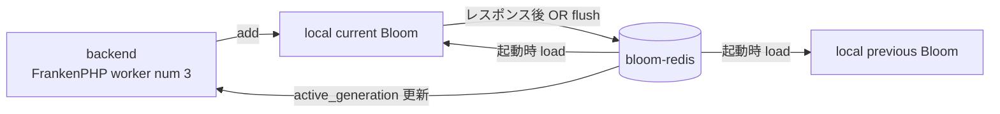
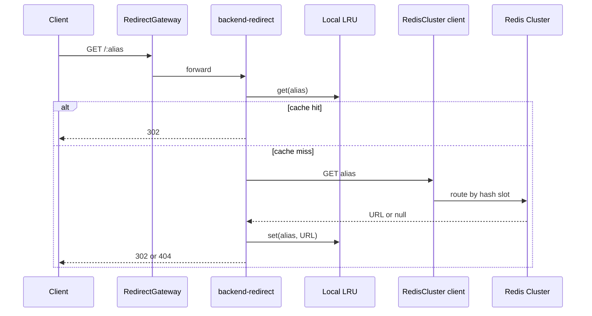

# distributed

Redis Cluster を使う分散構成です。登録系 backend と redirect 専用 backend を分けます。

## 構成



## データ

Redis は 12 master node の Cluster です。アプリは key を渡し、Redis Cluster の hash slot に routing を任せます。



保存形式:

```text
{alias} => {url}
```

例:

```text
bench-100000000-seed-1 => https://example.com/benchmark/bench-100000000-seed-1
```

## 登録



## Bloom filter 永続化

create 用の Bloom filter は `bloom-redis` に永続化します。alias の primary store である Redis Cluster とは分けています。



保存キー:

```text
bloom:aliases:active_generation
bloom:aliases:g:{generation}:bits
bloom:aliases:g:{generation}:meta
bloom:aliases:rotate_lock
```

判定は `current OR previous`、追加は `current` のみに行います。flush / rotate はレスポンス送信後に実行します。

| 変数 | 既定値 | 内容 |
| --- | ---: | --- |
| `BLOOM_PERSISTENCE_ENABLED` | `true` | Bloom filter 永続化を有効化 |
| `BLOOM_REDIS_HOST` | `bloom-redis` | 専用 Redis host |
| `BLOOM_REDIS_PORT` | `6379` | 専用 Redis port |
| `BLOOM_REDIS_KEY_PREFIX` | `bloom:aliases` | 保存 key prefix |
| `BLOOM_FLUSH_EVERY_ADDS` | `10000` | OR flush する追加件数 |
| `BLOOM_ROTATE_ESTIMATED_ITEMS` | `250000` | generation を進める推定件数 |
| `BLOOM_OLD_GENERATION_TTL_SECONDS` | `3600` | 古い世代を残す秒数 |

## リダイレクト



`backend-redirect` は Slim を通さず、`src/redirect-index.php` を直接実行します。Redis クライアントは phpredis です。

## リダイレクト Cache

process-local な LRU cache です。デフォルトは無効です。

```bash
REDIRECT_CACHE_MAX_ENTRIES=100000 task bench:all:large:scaled
```

| 変数 | 既定値 | 内容 |
| --- | ---: | --- |
| `REDIRECT_CACHE_MAX_ENTRIES` | `0` | 0 で無効。1 以上で FrankenPHP worker 内 cache を有効化 |

cache は replica / FrankenPHP worker ごとに独立し、worker 再起動で破棄されます。

## 主要 task

```bash
task distributed:up
task distributed:up:scaled
task distributed:down
task distributed:logs

task bench:all
task bench:all:scaled
task bench:all:medium
task bench:all:large
```
