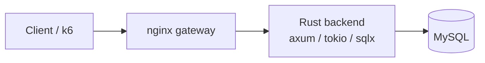
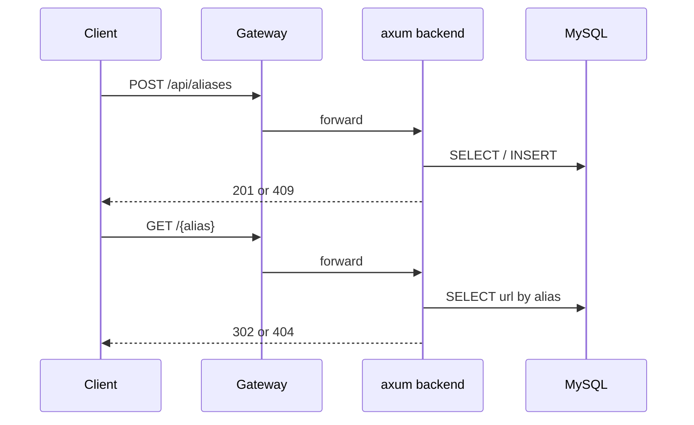
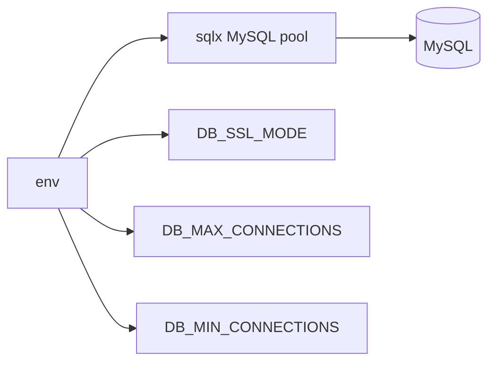
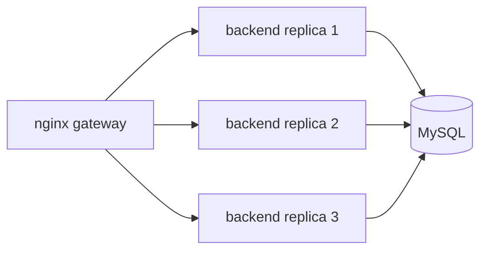

# simple-rs

`simple` と同じ API / MySQL schema を使う Rust 実装です。

## 構成



## リクエスト経路



## 役割

| 項目 | 内容 |
| --- | --- |
| HTTP | `axum` |
| async runtime | `tokio` |
| MySQL client | `sqlx` |
| store | MySQL |
| schema | `variants/simple/mysql/init/001_create_aliases.sql` と同等 |

## ルート

```text
GET  /health
POST /api/aliases
GET  /{alias}
```

## DB 接続



| 変数 | 既定値 | 備考 |
| --- | --- | --- |
| `DB_SSL_MODE` | `required` | `preferred` / `required` / `verify_ca` / `verify_identity` |
| `DB_MAX_CONNECTIONS` | `32` | backend container ごとの上限 |
| `DB_MIN_CONNECTIONS` | `min(4, max)` | 起動時に確保する接続数 |

scaled 時の最大接続数:

```text
BACKEND_SCALE * DB_MAX_CONNECTIONS
```

例:

```bash
DB_MAX_CONNECTIONS=32 BACKEND_SCALE=3 task bench:all:large:scaled
```

## スケーリング



```bash
task simple-rs:up:scaled
```
