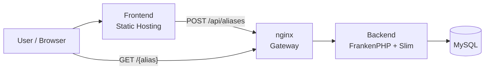
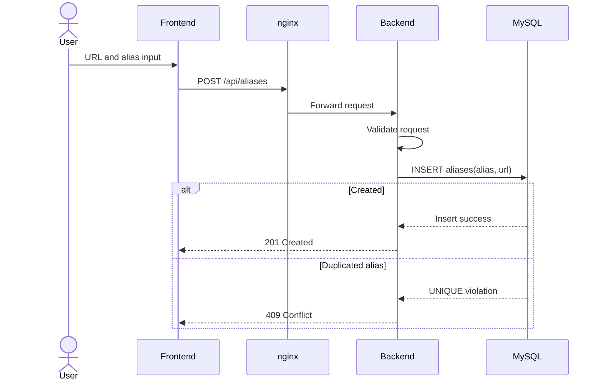
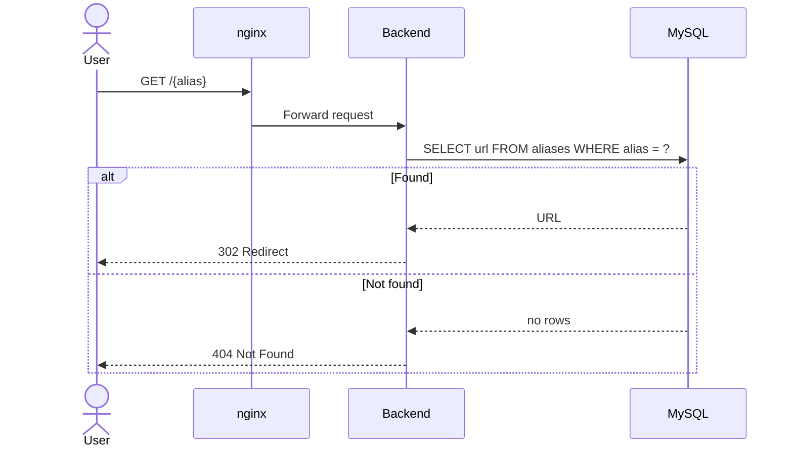

# Simple Architecture

このドキュメントは、`simple` 構成のインフラ構成と設計方針を整理します。

`simple` は短縮 URL サービスの基本構成です。Backend は Slim + FrankenPHP、保存先は MySQL です。Redis Cluster や local Bloom Filter は使わず、MySQL の `UNIQUE(alias)` 制約で alias の一意性を担保します。

## 目的

- 最小構成で短縮 URL サービスを実装する
- `distributed` 構成との比較基準を作る
- MySQL の一意制約によるシンプルな整合性管理を扱う
- gateway 有無による Backend 単体性能を比較できるようにする

## インフラ構成



## コンポーネント

### Frontend

`frontend` は `distributed` と共通で利用します。

API contract は `distributed` と同じにし、Backend 構成の違いを Frontend に漏らさない方針です。

### Gateway

nginx を Gateway として利用します。Caddy 構成もサブ比較用に残します。

simple では Backend が1種類だけなので、Gateway はすべてのリクエストを `backend` に転送します。

```text
/api/*   -> backend
/health  -> backend
/{alias} -> backend
```

### Backend

Backend は Slim + FrankenPHP で動作します。

- `GET /health`
- `POST /api/aliases`
- `GET /{alias}`

登録、リダイレクト、health check を同じ Backend worker pool で処理します。

### MySQL

MySQL は alias と URL の永続化を担当します。

```text
aliases
  id
  alias
  url
  created_at
  updated_at
```

`alias` には UNIQUE 制約を設定し、同じ alias の重複登録を MySQL 側で拒否します。

## 登録フロー



## リダイレクトフロー



## ユニーク検証

`simple` では MySQL の `UNIQUE(alias)` を一意性の source of truth とします。

```text
INSERT success:
  201 Created

UNIQUE violation:
  409 Conflict
```

アプリケーション側では事前に存在確認をせず、登録時の INSERT 結果で重複を判断します。これにより、同時リクエストでも MySQL の制約に一意性判断を任せます。

## ベンチマーク用 direct 構成

gateway の影響を切り分けるため、direct 構成では `backend` を直接 expose します。

```text
localhost:8080 -> backend
```

simple は Backend が1種類だけなので、direct 構成でも同じ Backend が以下をすべて処理します。

```text
seed-aliases
warmup-redirect
redirect
create-existing
warmup-create
create
```

比較は `simple` / `simple-rs` / `distributed` の 3 構成で同じ scenario を実行します。

## distributed との差分

```text
simple:
  gateway -> backend -> MySQL

distributed:
  gateway -> backend          -> Redis Cluster
          -> backend-redirect -> Redis Cluster
```

simple は構成が単純で一貫性を MySQL に寄せます。distributed は Redis Cluster と redirect 専用 Backend によって throughput と tail latency の改善を狙います。
